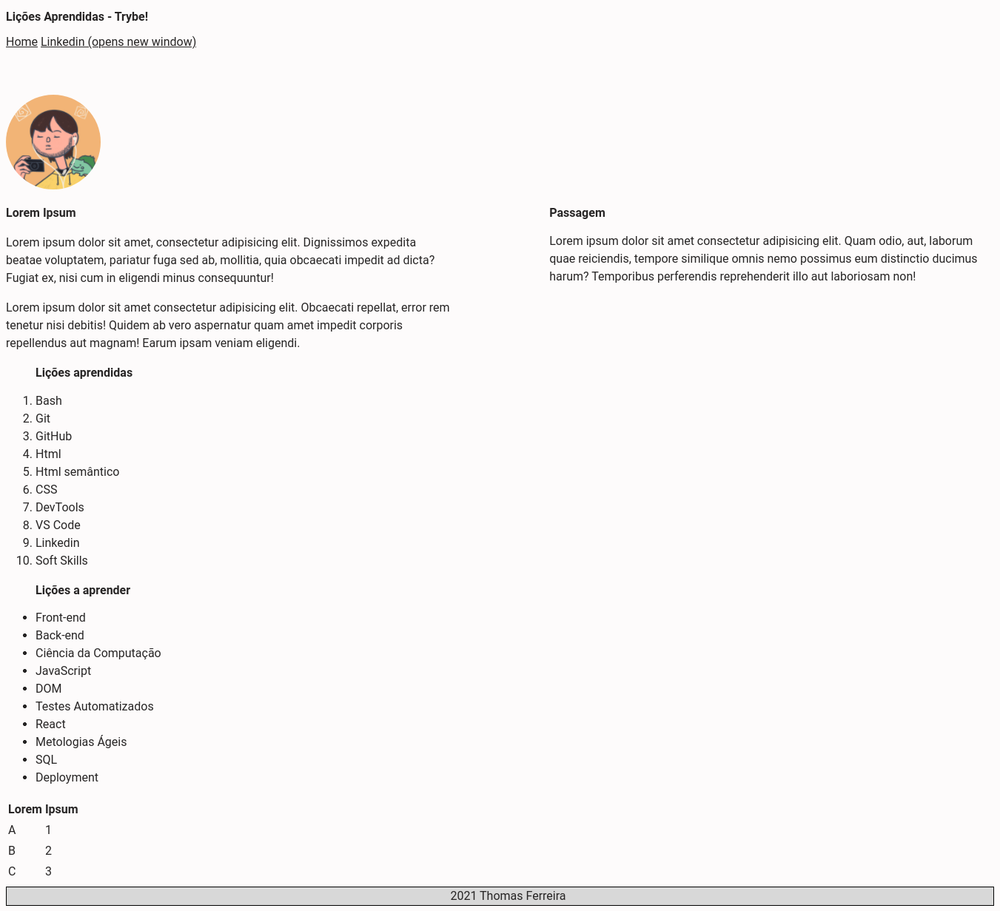

# Trybe Project Lessons Learned 22/06/2021
 

  
  

 

## Habilidades

- Utilizar HTML para construir páginas WEB;
- Utilizar HTML semântico para tornar sua página mais acessível e melhor ranqueada;
- Utilizar CSS para adicionar estilo e posicionar elementos.

## Desenvolvimento
[Página](https://weltonthomasferreira.github.io/trybe-project-lessons-learned/) HTML estilizada com CSS.

## Resultados

- `1` dia de projeto;
- `12` requisitos;
- Percentual de cumprimento de requisitos obrigatórios `100.00%`;
- Percentual de cumprimento de requisitos totais `100.00%`.
